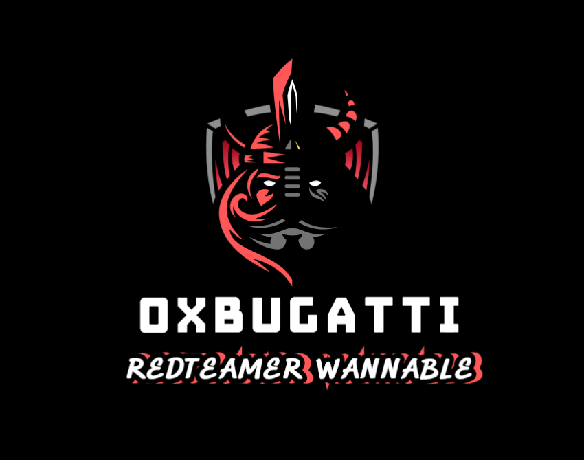

# Hi from 0xbugatti

## Resume
### Cyber Secrity  student@Computer Science Alexandria University

- Learning Basics of Computer Science ,Take a general overview on Cyber Security Different Fields on Specific Modules and Subjects for every field such as (Secure Coding, Secured Software Design ,Mobile Application Security ,Web Application Security ,Network (LAN-WAN) Security ,IOT Security and Operating System Security)  
- go through the latest techniques used to implement applications used by developers and system designers nowadays such as (on-cloud applications ,servers and databases ,APIs Communications, SAAS and PAAS ...etc) 
- learning how to secure it and its miscommunications and vulnerabilities
- Learning Basics of Data Science Tools to be able to do Integration between Securing Systems and Data Science and that can be Used in several Projects such as (Malware Analysis , Bug Bounty Enumeration , CVEs Mitigations and Dark web Monitoring)

  
### Incident response team member @ Coordinatesme ,UAE

I bring a wealth of experience from my tenure as an Incident Response (IR) Team member at Coordinates ME one of the leading Companies that supply Detection and response management service in GULF where I honed my skills on 
- variety of Endpoint Detection and Response (EDR) solutions 
- Security Information and Event Management (SIEM) platforms.
- ability to swiftly identify and respond to security incidents.
- Working in a dynamic environment
- actively participated in incident investigations

### Skills
- Web Application Black box Security testing 
- Application Code review , threat modeling and SSDLC process Execution
- Recommendation & Vulnerability Fix
- Lateral movement & Exfiltration TTP Execution & Practical Investigation
- Client Side and  Hardware physical access  Attacks
- Wireless Network attacks :
	- NFC 
	- RFID
	- WIFI
	- Bluetooth
- Active Directory Enterprise Attacks & Investigation
- Malware Development & AV Evasion
- Incident handling and response
- Web attacks investigation 
- Network attacks investigation
- Endpoint Attacks investigation
### Programming languages

### Data Bases

### Vulnerability Assessment tools

### Studied Courses

### EDRs

### SEIM

Cloud 

## Quick About

I'm Mohamed Nasr AKA 0xbugatti , a Cyber Security professional deeply committed to fortifying digital landscapes. My academic journey through the Cyber Security field at the Computer Science Faculty culminated in a comprehensive skill set.  
I have programming languages, including C++, C#, Python, PowerShell, PHP, and JavaScript. This broad skill set enables me to deal with several themes Like Execute recent red teaming TTPs, Evading Security Solutions ,Applications Structures and flows ,Enhancing SSDLC Process. In the realm of penetration testing, I excel in Web Application security, following the methodologies outlined by the Open Web Application Security Project (OWASP). My expertise spans Network Services Penetration Testing, as well as Amazon and Azure Penetration Testing methodologies and Configuration and Implementation Security.  
Additionally, I boast in-depth knowledge of Antivirus Evasion Techniques.My skill set further includes a profound understanding of Active Directory Penetration Testing ,Privilege Escalation Techniques in both Linux and Windows environments, a crucial asset in navigating complex infrastructures.  
Beyond technical capabilities, I am a solution-oriented professional with a keen eye for emerging threats. Eager to bring my extensive knowledge and hands-on experience to a dynamic team, I am committed to contributing to the development and implementation of robust security measures. Together, let's fortify systems against evolving cyber threats and create a secure digital future

## Links

