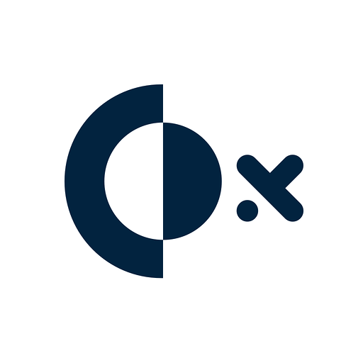

  

 

## Focus Areas

<table width="100%" cellspacing="4" cellpadding="8">
  <tr>
    <td align="left" valign="middle" width="180"><b>EDR & Defense</b></td>
    <td valign="middle">
      &nbsp;&nbsp;
      &nbsp;&nbsp;
      &nbsp;&nbsp;
      &nbsp;&nbsp;
      &nbsp;&nbsp;
      &nbsp;&nbsp;
      &nbsp;&nbsp;
      &nbsp;&nbsp;
      &nbsp;&nbsp;
      
    </td>
  </tr>
  <tr>
    <td align="left" valign="middle"><b>SIEM & Monitoring</b></td>
    <td valign="middle">
      &nbsp;&nbsp;
      &nbsp;&nbsp;
      &nbsp;&nbsp;
      &nbsp;&nbsp;
      &nbsp;&nbsp;
      
    </td>
  </tr>
  <tr>
    <td align="left" valign="middle"><b>Reverse Engineering</b></td>
    <td valign="middle">
      &nbsp;&nbsp;
      &nbsp;&nbsp;
      &nbsp;&nbsp;
      &nbsp;&nbsp;
      &nbsp;&nbsp;
      &nbsp;&nbsp;
      &nbsp;&nbsp;
      
    </td>
  </tr>
  <!--
  <tr>
    <td align="left" valign="middle"><b>Recon & Enumeration</b></td>
    <td valign="middle">
      &nbsp;&nbsp;
      &nbsp;&nbsp;
      &nbsp;&nbsp;
      &nbsp;&nbsp;
      &nbsp;&nbsp;
      
    </td>
  </tr>
  <tr>
    <td align="left" valign="middle"><b>Web Exploitation</b></td>
    <td valign="middle">
      &nbsp;&nbsp;
      &nbsp;&nbsp;
      &nbsp;&nbsp;
      &nbsp;&nbsp;
      &nbsp;&nbsp;
      
    </td>
  </tr>
  -->
  <tr>
    <td align="left" valign="middle"><b>Exploitation & C2</b></td>
    <td valign="middle">
      &nbsp;&nbsp;
      &nbsp;&nbsp;
      &nbsp;&nbsp;
      &nbsp;&nbsp;
      &nbsp;&nbsp;
      
    </td>
  </tr>
  <tr>
    <td align="left" valign="middle"><b>Post-Exploitation</b></td>
    <td valign="middle">
      &nbsp;&nbsp;
      &nbsp;&nbsp;
      &nbsp;&nbsp;
      &nbsp;&nbsp;
      &nbsp;&nbsp;
      &nbsp;&nbsp;
      &nbsp;&nbsp;
      &nbsp;&nbsp;
      
    </td>
  </tr>
  <tr>
    <td align="left" valign="middle"><b>Platforms</b></td>
    <td valign="middle">
      &nbsp;&nbsp;
      &nbsp;&nbsp;
      &nbsp;&nbsp;
      &nbsp;&nbsp;
      &nbsp;&nbsp;
      
    </td>
  </tr>
  <tr>
    <td align="left" valign="middle"><b>MalDev</b></td>
    <td valign="middle">
      &nbsp;&nbsp;
      &nbsp;&nbsp;
      &nbsp;&nbsp;
      &nbsp;&nbsp;
      
    </td>
  </tr>
  <tr>
    <td align="left" valign="middle"><b>FrontEnd</b></td>
    <td valign="middle">
      
    </td>
  </tr>
  <tr>
    <td align="left" valign="middle"><b>BackEnd</b></td>
    <td valign="middle">
      
    </td>
  </tr>
  <tr>
    <td align="left" valign="middle"><b>Tooling</b></td>
    <td valign="middle">
      
    </td>
  </tr>
  <tr>
    <td align="left" valign="middle"><b>DevOps</b></td>
    <td valign="middle">
      
    </td>
  </tr>
</table>

<table>
  <tr>
    <td valign="middle" align="center" width="20%">
      

        
          
        
      

    </td>
    <td valign="middle" width="80%">
      
    </td>
  </tr>
</table>

---

## Featured Projects

<table>
  <tr>
    <td align="center">
      
    </td>
    <td align="center">
      
    </td>
    <td align="center">
      
    </td>
  </tr>
  <tr>
    <td align="center">
      
    </td>
    <td align="center">
      
    </td>
    <td align="center">
      
    </td>
  </tr>
</table>

---

## Activity

<table width="100%">
  <tr>
    <td width="50%" align="center">
      
    </td>
    <td width="50%" align="center">
      
    </td>
  </tr>
</table>

---

---

## Connect

&nbsp;&nbsp;&nbsp;
&nbsp;&nbsp;&nbsp;
&nbsp;&nbsp;&nbsp;
&nbsp;&nbsp;&nbsp;

 

> *"The quieter you become, the more you are able to hear."*

 

